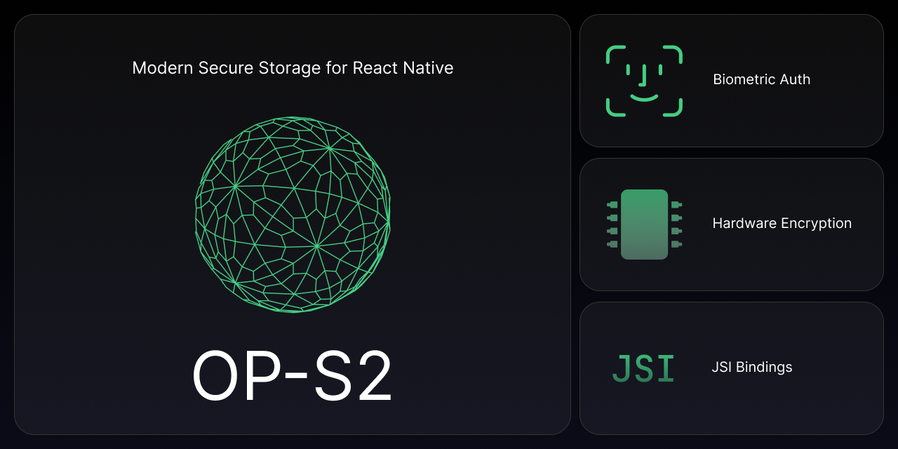

<pre align="center">yarn add @op-engineering/op-s2</pre>

<div align="center">
  <a align="center" href="https://github.com/ospfranco?tab=followers">
    
  </a>
  <br />
  <a align="center" href="https://twitter.com/ospfranco">
    
  </a>
</div>
<br />

---

Modern encryption module for React Native. Uses `Keychain` on iOS and the [official libraries](https://developer.android.com/jetpack/androidx/releases/security), `KeyStore`/`EncryptedSharedPreferences`, on Android.

Created by [ospfranco](https://github.com/sponsors/ospfranco).

Join the Discord

https://discord.gg/W9XmqCQCKP

## Motivation

Other React Native stores hand-roll their encryption, via OpenSSL (does not use hardware when possible) or raw implementation of algorithms (outdated algorithms or improper implementations).

The benefit of using the official implementations is the use of encryption hardware on-device when possible. Using the hardware chips provides yet another layer of security to prevent tampering with the data as it is being decrypted/encrypted/stored.

## Examples

```ts
import { get, set, ACCESSIBILITY } from '@op-engineering/op-s2';

const { error } = set({
  key: 'myKey',
  value: 'myValue',
  // Only valid for iOS you have more control when to prompt for authentication
  accessibility: ACCESSIBILITY.WHEN_PASSCODE_SET_THIS_DEVICE_ONLY,
  // OR works for both iOS and Android
  withBiometrics: true,
});

const { error, value } = get({
  key: 'myValue',
  withBiometrics: true,
});

const { error } = del({
  key: 'myValue',
  withBiometrics: true,
});
```

### iOS Accessibility

On iOS you can specify an accessibility value which allows you to customize when the data is readable. It is mutually exclusive with `withBiometrics`. So pick one or the other.

| Key                                 | Explanation                                                                                                                                                                                       |
| ----------------------------------- | ------------------------------------------------------------------------------------------------------------------------------------------------------------------------------------------------- |
| AFTER_FIRST_UNLOCK                  | The data in the keychain item cannot be accessed after a restart until the device has been unlocked once by the user. This may be useful if you need to access the item when the phone is locked. |
| AFTER_FIRST_UNLOCK_THIS_DEVICE_ONLY | Similar to AFTER_FIRST_UNLOCK, except the entry is not migrated to a new device when restoring from a backup.                                                                                     |
| ALWAYS                              | The data in the keychain item can always be accessed regardless of whether the device is locked. This is the least secure option.                                                                 |
| ALWAYS_THIS_DEVICE_ONLY             | Similar to ALWAYS, except the entry is not migrated to a new device when restoring from a backup.                                                                                                 |
| WHEN_PASSCODE_SET_THIS_DEVICE_ONLY  | Similar to WHEN_UNLOCKED_THIS_DEVICE_ONLY, except the user must have set a passcode to store an entry. If the user removes their passcode, the entry will be deleted.                             |
| WHEN_UNLOCKED                       | The data in the keychain item can be accessed only while the device is unlocked by the user.                                                                                                      |
| WHEN_UNLOCKED_THIS_DEVICE_ONLY      | Similar to WHEN_UNLOCKED, except the entry is not migrated to a new device when restoring from a backup.                                                                                          |

### With biometrics

When using biometric info you need to include `NSFaceIDUsageDescription` in your info.plist, which will prompt the user for permission to use faceID.

## Secure Enclave

The library already uses the [Secure Enclave](https://support.apple.com/en-gb/guide/security/sec59b0b31ff/web) to encrypt the data before saving it on the keychain. However, it is not possible to store data directly on the Secure Enclave as it is meant to store the private part of asymmetrical keys, meaning data saved there cannot be retrieved to user space.

## Android Quirks

The official Android crypto implementation uses hardware-backed-up encryption when possible. However, it will depend on the vendor to use the hardware chips or not, there is not much that can be done about that.

The library currently depends on the latest available versions:

```
androidx.security:security-crypto:1.1.0-alpha06
androidx.biometric:biometric:1.2.0-alpha05
```

And will be continually updated to support fixes and updates.

## TODO

- [ ] Add `getAllKeys`, `getAllItems` and `deleteAllItems` methods (if possible)
- [ ] Device testing list
- [ ] Security audits

## License

MIT License
