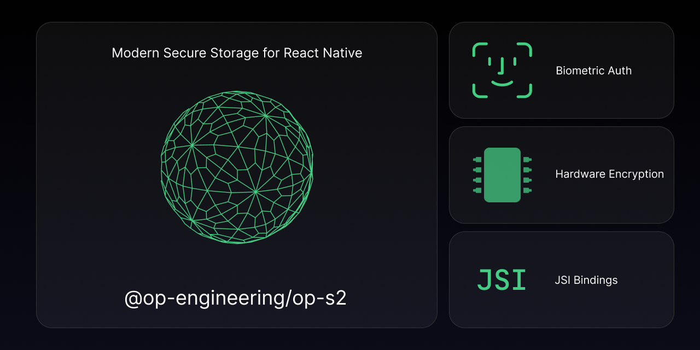

<pre align="center">yarn add @op-engineering/op-s2</pre>

<div align="center">
  <a align="center" href="https://github.com/ospfranco?tab=followers">
    
  </a>
  <br />
  <a align="center" href="https://twitter.com/ospfranco">
    
  </a>
</div>
<br />

---

Modern encryption module for React Native. Uses Keychain on iOS and KeyStore/EncryptedSharedPreferences on Android. It uses hardware backed encryption when possible as well as JSI bindings for speed. It also supports Biometric authentication.

Created by @ospfranco. Please consider Sponsoring, none of this work is for free. I pay for it with my time and knowledge. If you are a company in need of help with your React Native/React apps feel free to reach out. I also do a lot of C++ and nowadays Rust.

## Motivation

Writting/Reading a value takes ~1ms. This might seem slow compared to other key/value stores, however other stores hand roll their own encryption (via openSSL or raw implementation of algorithms). The benefit of using the official implementations is that it will use the encryption hardware on device when possible. Using the hardware chips provides yet another layer of security to prevent tampering with the data as it being decrypted/encrypted/stored.

## Examples

```ts
import { get, set, ACCESSIBILITY } from '@op-engineering/op-s2';

const { error } = set({
  key: 'myKey',
  value: 'myValue',
  // Only valid for iOS you have more control when to prompt for authentication
  // accessibility: ACCESSIBILITY.WHEN_PASSCODE_SET_THIS_DEVICE_ONLY,
  // OR works for both iOS and Android
  withBiometrics: true,
});

const { error, value } = get({
  key: 'myValue',
  withBiometrics: true,
});

const { error } = del({
  key: 'myValue',
  withBiometrics: true,
});
```

### iOS Accessibility

On iOS you can specify an accesibility value which allows to customize when the data is readable. It is mutually exclusive biometrics. So pick one or the other.

## TODO

- [ ] Add `getAllKeys`, `getAllItems` and `deleteAllItems` methods (if possible)
- [ ] Support Secure Enclave on Apple devices
- [ ] Create testing device list
- [ ] Security audits

## License

MIT License
